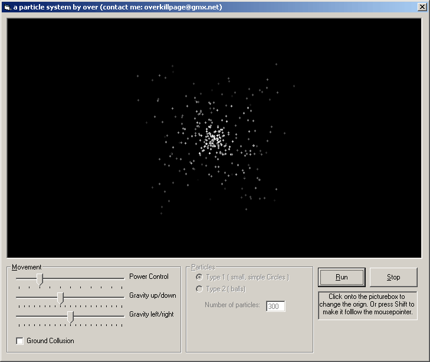



## \[\_a particle system, pure VB 1\.1\_\]

### Description

A particle system, done in pure VB. It shows how to create such an effect system. The program is not accelerated in any way and does not use DirectX or OpenGL. It just demonstrates the technique.

It can be great fun to watch the animation and play arround with the gravity settings etc. ;)

Ver. 1.1 -added an additional particle type that looks a loot better in my oppionion ;)

-Some other changes
 
### More Info
 
nice particle effects ;)

             |
---                |---
**Submitted On**   |2003-04-18 13:35:06
**By**             |[over](https://github.com/Planet-Source-Code/PSCIndex/blob/master/ByAuthor/over.md)
**Level**          |Advanced
**User Rating**    |4.9 (79 globes from 16 users)
**Compatibility**  |VB 6\.0
**Category**       |[Graphics](https://github.com/Planet-Source-Code/PSCIndex/blob/master/ByCategory/graphics__1-46.md)
**World**          |[Visual Basic](https://github.com/Planet-Source-Code/PSCIndex/blob/master/ByWorld/visual-basic.md)
**Archive File**   |[\[\_a\_partic1575704182003\.zip](https://github.com/Planet-Source-Code/over-a-particle-system-pure-vb-1-1__1-44415/archive/master.zip)

